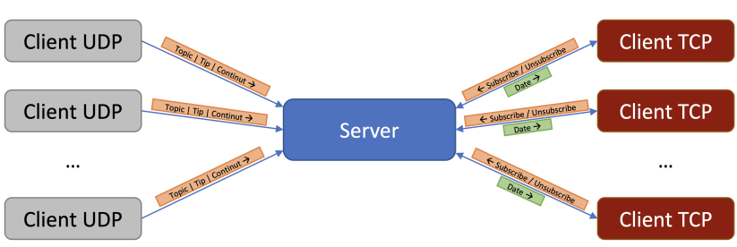

# Aplicatie client-server TCP si UDP pentru gestionarea mesajelor
## Descriere generala

Platforma contine trei componente:

- serverul (unic) va realiza legatura intre clientii din platforma, cu scopul publicarii si abonarii la mesaje;
- clientii TCP vor avea urmatorul comportament: un client TCP se conecteaza la server, poate primi (in orice moment) de la tastatura (interactiunea cu utilizatorul uman) comenzi de tipul subscribe si unsubscribe si afiseaza pe ecran mesajele primite de la server;
- clientii UDP (care au venit gata implementati din partea echipei responsabile) publica, prin trimiterea catre server, mesaje in platforma propusa folosind un protocol predefinit.


Functionalitatea este ca fiecare client TCP sa primeasca de la server acele mesaje, venite de la client, ii UDP, care fac referire la topic-urile la care sunt abonati (as,a cum se poate observa si in imaginea de mai jos). Aplicatia va include si o functionalitate de SF (store-and-forward) cu privire la mesajele trimise atunci cand clientii TCP sunt deconectati.



## Serverul
Serverul va avea rolul de broker (componenta de intermediere) in platforma de gestionare a mesajelor. Acesta va deschide 2 socketi (unul TCP si unul UDP) pe un port primit ca parametru si va astepta conexiuni/datagrame pe toate adresele IP disponibile local.

1)  **Pornire**

	Pornirea serverului se va face folosind comanda:
	```./server <PORT_DORIT>```

2) **Mesaje afisate**

	Pentru monitorizarea activitatii serverului, se va face afisarea (la iesirea 	standard) a evenimentelor de conectare, respectiv deconectare a clientilor TCP. Aceasta 	se va face folosind mesaje de forma:
	```
	New client connected from IP:PORT.
	Client disconnected.
	```

3) **Comenzi acceptate**

	Serverul va accepta, de la tastatura, doar comanda **exit**, ce va avea ca efect inchiderea simultana a serverului si a tuturor clientilor TCP conectati in acel moment.

4) **Comunicarea cu clientii UDP**
	Serverul va primi mesaje de la clientii UDP, ce respecta formatul definit in tabelul de mai jos:

	| _ | **topic** | **tip_date** | **continut** |
	|--|--|--|--|
	| **Dimensiune** | 50 de octeti | 1 octet | Maxim 1500 de octeti | 
	|	**Format** | Sir de maxim 50 de caractere, terminat cu \0 pentru dimensiuni mai mici de 50 | unsigned int pe 1 octet folosit pentru a specifica tipul de date al continutului | Variabil in functie de tipul de date, asa cum este descris in sectiunea TCP |

## Clientii TCP
Clientii TCP se pot abona si dezabona la topic-uri prin mesaje trimise catre server.

1) **Pornire**

	Pornirea unui client TCP se face cu urmatoarea comanda:

	```./subscriber <ID_CLIENT> <IP_SERVER> <PORT_SERVER>```
	
	In comanda de mai sus, **ID_CLIENT** este un sir de caractere ce reprezinta ID-ul clientului, **IP_SERVER** reprezinta adresa IPv4 a serverului reprezentata folosind notatia dotted-decimal (exemplu 1.2.3.4), iar **PORT_SERVER** reprezinta portul pe care serverul asteapta conexiuni. La pornire, clientul se conecteaza la server cu ID-ul dat ca parametru.

2) **Comenzi acceptate**

	Clientii de TCP pot primi de la tastatura una dintre urmatoarele comenzi:
	- ```subscribe <TOPIC> <SF>``` - anunta serverul ca un client doreste sa se aboneze la mesaje pe topic-ul TOPIC, iar SF poate avea valoarea 0 sau 1 (se va explica in sectiunea cu Functionalitatea aplicatiei)
	- ```unsubscribe <TOPIC>``` - anunta serverul ca un client doreste sa se dezaboneze de la topic-ul **TOPIC**
	- **exit** - comanda va fi folosita pentru deconectarea clientului de la server si inchiderea sa.

3) **Mesaje afisate**
	Pentru fiecare comanda primita de la tastatura, clientul va afisa o linie de feedback de tipul urmator:
	```
	Subscribed to topic. 
	Unsubscribed from topic.
	```

	Aceste mesaje vor fi afis,ate doar dupa ce comenzile au fost trimise catre server. 
Pentru fiecare mesaj primit de la server (adica date de pe un topic la care clientul este abonat), se va afisa imediat un mesaj de forma:
	```<IP_CLIENT_UDP>:<PORT_CLIENT_UDP> - <TOPIC> - <TIP_DATE> - <VALOARE_MESAJ>```

	De exemplu, daca un client UDP cu adresa IP 1.2.3.4 publica la topic-ul UPB/precis/1/temperature valoarea 23.5 ca numar real cu 2 zecimale, folosind port-ul sursa 4573, atunci in client se va afisa:

	```1.2.3.4:4573 - UPB/precis/1/temperature - SHORT_REAL - 23.5```

	Pentru tipurile de date, se vor folosi notatiile din tabelul de mai jos, iar valorile vor fi afisate in format human-readable.

	| **Tip payload** | **Identificator tip (folosit de clienti)** | **Valoarea tip date** | **Format payload** |
	|--|--|--|--|
	| Numar intreg fara semn | INT | 0 | Octet de semn* urmat de un uint32_t formatat conform network byte order |
	| Numar real pozitiv cu 2 zecimale | SHORT REAL | 1 | uint16_t reprezentand modulul numarului inmultit cu 100 |
	| Numar real | FLOAT | 2 | Un octet de semn, urmat de un uint32_t (in network byte order) reprezentand modulul numarului obtinut din alipirea partii intregi de partea zecimala a numarului, urmat de un uint8_t ce reprezinta modulul puterii negative a lui 10 cu care trebuie inmultit modulul pentru a obtine numarul original (in modul) | 
	| Sir de caractere | STRING | 3 | Sir de maxim 1500 de caractere, terminat cu \0 sau delimitat de finalul datagramei pentru lungimi mai mici |

    
	*Octetul de semn va fi 0 pentru numerele pozitive, 1 pentru cele negative

## Functionarea aplicatiei
Initializarea aplicatiei este data de pornirea serverului, la care ulterior se vor putea conecta un numar variabil de clienti TCP si UDP.
Fiecare client TCP va fi identificat prin ID-ul cu care acesta a fost pornit (ID_CLIENT), care poat fi un sir de maxim 10 caractere ASCII. La un moment dat, nu vor exista 2 clienti TCP conectati cu acelasi ID. Daca un client TCP incearca sa se conecteze la server cu acelasi ID ca al altui client deja conectat, serverul va afisa mesajul urmator (in acelasi timp, clientul se va inchide):

```Client <ID_CLIENT> already connected.```

Serverul trebuie sa tina evidenta topic-urilor la care este abonat fiecare dintre clienti. La primirea unui mesaj UDP valid, serverul trebuie sa asigure trimiterea acestuia catre toti clientii TCP care sunt abonati la topic-ul respectiv.
Comanda de abonare la un topic are un parametru de SF (store-and-forward). Daca acesta este setat la 1, inseamna ca un client doreste sa se asigure ca nu pierde niciun mesaj trimis pe acel topic. Astfel, daca un client TCP se deconecteaza, apoi revine, el primi de la server toate mesajele ce nu i-au fost trimise deja, chiar daca acestea au fost trimise in timpul in care clientul a fost deconectat, conform unei politici de tipul store-and-forward.

## Copyright 

Drepturile asupra enuntului temei, clientilor UDP si scriptului de testare apartine echipei PCom, facultatea ACS, UPD (2022).